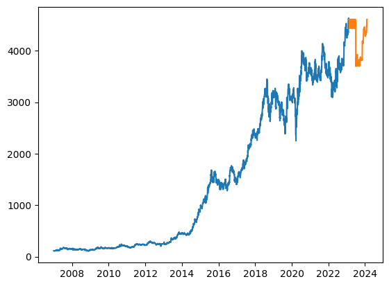

# Stock Price Forecasting

This project utilized the RandomForestRegressor model from Scikit-Learn module for stock price forecasting for about 365 days (one year).

The main goal was to predict the stock prices of a particular firm (hypothetial data used here) by training a machine learning model on it's past stock price data.

The 'X' dataframe containes date, month and year in different columns and 'y' has 'OPEN' stock price. It was then trained to forecast the 'OPEN' stock prices.

Different models were tested for the forecasting like decision tree, linear regression, etc. but the random forest regression model gave the best results, i.e, lowest mean absolute error which was around 10. 

